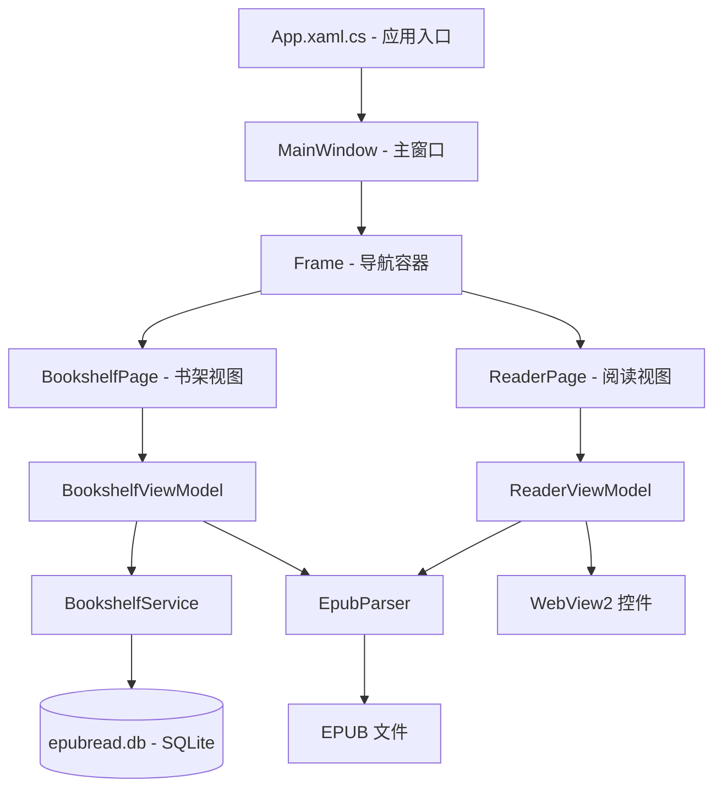

## 产品概述

一个基于 WPF 的 EPUB 电子书阅读器，提供书架管理界面与阅读器界面。用户可从本地导入 EPUB 文件，书架以封面缩略图形式展示已导入的书籍；点击书籍进入阅读视图，通过 WebView2 渲染 EPUB 内容，支持章节目录导航与上下翻页。

## 核心功能

- **书架展示**：以网格布局展示已导入的 EPUB 书籍，每本书显示封面缩略图、书名、作者；无封面的书籍显示默认占位图
- **导入书籍**：通过"导入"按钮打开本地文件对话框，选择 .epub 文件后自动解析元数据与封面，加入书架并持久化到 SQLite
- **删除书籍**：支持从书架中移除书籍（不删除原始文件），同步更新 SQLite 数据库
- **EPUB 阅读**：点击书架上的书籍进入阅读视图，WebView2 渲染当前章节的 XHTML/HTML 内容，顶部显示书名
- **章节导航**：左侧可折叠章节目录，点击章节跳转；支持上一章/下一章按钮翻页，显示进度指示
- **返回书架**：阅读视图中点击返回按钮回到书架界面

## 技术选型

| 层级 | 技术选择 | 说明 |
| --- | --- | --- |
| **UI 框架** | WPF (.NET 10.0) | 项目现有框架，使用 XAML + C# |
| **Web 渲染** | Microsoft.Web.WebView2 | 基于 Edge Chromium，支持现代 HTML5/CSS3，完美渲染 EPUB 内容 |
| **架构模式** | MVVM | 视图-视图模型-模型分离，利用 WPF 数据绑定和命令 |
| **EPUB 解析** | System.IO.Compression + System.Xml.Linq | EPUB 本质是 ZIP 压缩包，包含标准化 XML 文件，手动解析无需第三方库 |
| **数据持久化** | Microsoft.Data.Sqlite | SQLite 本地数据库，具备事务支持，便于后续扩展阅读进度、书签等功能 |
| **MVVM 基础设施** | CommunityToolkit.Mvvm | 轻量级 MVVM 工具包，提供 ObservableObject、RelayCommand 等，减少样板代码 |


## 实现方案

### EPUB 解析策略

EPUB 文件是 ZIP 压缩包，通过以下步骤手动解析：

1. 解压读取 `META-INF/container.xml`，获取 `.opf` 文件路径
2. 解析 OPF 文件，提取 `<metadata>`（书名、作者、封面ID）、`<manifest>`（资源清单）、`<spine>`（阅读顺序）
3. 根据 cover ID 在 manifest 中定位封面图片，解压到封面缓存目录
4. 解析 NCX/NAV 文件获取章节目录结构
5. 按 spine 顺序按需加载各章节 XHTML 内容，注入阅读样式后交由 WebView2 渲染

### SQLite 数据持久化

- **数据库文件**：`%AppData%/EpubRead/epubread.db`
- **表结构**：一张 `Books` 表存储书架书籍信息
- **字段**：`Id` (TEXT PRIMARY KEY, GUID)、`Title` (TEXT)、`Author` (TEXT)、`FilePath` (TEXT)、`CoverPath` (TEXT, 封面缓存路径)、`ImportDate` (TEXT, ISO 8601)
- **封面缓存**：封面图片仍缓存到 `%AppData%/EpubRead/covers/` 目录
- **数据库初始化**：应用启动时在 `App.xaml.cs` 中自动创建数据库和表（`CREATE TABLE IF NOT EXISTS`）
- **操作接口**：`BookshelfService` 提供 `GetAllBooks()`、`AddBook()`、`RemoveBook()` 方法，内部使用参数化 SQL 防注入

### 阅读器内容渲染

- 从 EPUB 中提取的 XHTML 章节内容，注入基础阅读样式（字体、行高、边距、最大宽度 800px 居中）
- 通过 WebView2 的 `NavigateToString()` 加载 HTML 字符串
- 目录侧边栏可显示/隐藏切换

## 架构设计

### 系统架构图



### 数据流


## 实现细节

### 目录结构

```
EpubRead/
├── Models/
│   ├── Book.cs                    # [NEW] 书籍数据模型：Id, Title, Author, FilePath, CoverPath, ImportDate
│   ├── EpubBook.cs                # [NEW] EPUB 解析结果模型：Title, Author, CoverImage, Chapters, BasePath
│   └── Chapter.cs                 # [NEW] 章节模型：Title, Href, Content, Order
├── ViewModels/
│   ├── BookshelfViewModel.cs      # [NEW] 书架 VM：Books 集合，ImportCommand，DeleteCommand，OpenBookCommand
│   └── ReaderViewModel.cs         # [NEW] 阅读器 VM：CurrentChapter, Chapters, PrevCommand, NextCommand, GoBackCommand
├── Views/
│   ├── BookshelfPage.xaml         # [NEW] 书架视图：UniformGrid 布局，BookCard 模板，导入按钮，空状态提示
│   ├── BookshelfPage.xaml.cs      # [NEW] 书架视图代码后置（最小化，仅 InitializeComponent）
│   ├── ReaderPage.xaml            # [NEW] 阅读视图：WebView2 + 可折叠目录侧边栏 + 底部导航栏
│   └── ReaderPage.xaml.cs         # [NEW] 阅读视图代码后置（初始化 WebView2，处理 CoreWebView2InitializationCompleted）
├── Services/
│   ├── EpubParser.cs              # [NEW] EPUB 解析服务：Parse() 解压并解析容器/OPF/NCX，ExtractCover() 提取封面
│   └── BookshelfService.cs        # [NEW] SQLite 书架持久化服务：InitializeDatabase()/GetAllBooks()/AddBook()/RemoveBook()
├── Converters/
│   └── CoverPathConverter.cs      # [NEW] 值转换器：封面路径 → BitmapImage，处理缺省占位图
├── App.xaml                       # [MODIFY] 配置全局样式资源（深色主题背景色、按钮样式等）
├── App.xaml.cs                    # [MODIFY] 应用启动时初始化数据目录和 SQLite 数据库
├── MainWindow.xaml                # [MODIFY] 替换空 Grid 为 Frame 导航容器，窗口标题改为"EPUB 阅读器"，尺寸 1200x800
├── MainWindow.xaml.cs             # [MODIFY] 添加页面导航服务逻辑，默认加载 BookshelfPage
└── EpubRead.csproj                # [MODIFY] 添加 NuGet 引用：Microsoft.Web.WebView2, CommunityToolkit.Mvvm, Microsoft.Data.Sqlite
```

### 关键接口设计

```
// 书架中的书籍条目
public class Book
{
    public string Id { get; set; }
    public string Title { get; set; }
    public string Author { get; set; }
    public string FilePath { get; set; }
    public string? CoverPath { get; set; }
    public DateTime ImportDate { get; set; }
}

// EPUB 解析结果
public class EpubBook
{
    public string Title { get; set; }
    public string Author { get; set; }
    public byte[]? CoverImage { get; set; }
    public List<Chapter> Chapters { get; set; }
    public string BasePath { get; set; }
}

// 章节结构
public class Chapter
{
    public string Title { get; set; }
    public string Href { get; set; }
    public string? Content { get; set; }
    public int Order { get; set; }
}

// BookshelfService 核心方法
public class BookshelfService
{
    public void InitializeDatabase();                    // CREATE TABLE IF NOT EXISTS
    public List<Book> GetAllBooks();                     // SELECT * FROM Books ORDER BY ImportDate DESC
    public void AddBook(Book book);                      // INSERT INTO Books
    public void RemoveBook(string bookId);               // DELETE FROM Books WHERE Id = @id
}
```

### 性能注意事项

- EPUB 章节内容按需加载：仅在导航到章节时才从 EPUB 解压对应 HTML，避免一次性加载全部内容导致内存压力
- 封面图片解压后缓存到本地，后续直接从缓存读取，避免重复解压
- 大型 EPUB 文件（>50MB）处理：使用流式解压而非全部加载到内存
- SQLite 使用参数化查询，避免 SQL 注入；数据库连接使用 `using` 确保释放
- WebView2 需确保运行时已安装（Windows 11 内置，Windows 10 可通过 Evergreen Bootstrapper 自动安装）

## 设计风格

采用现代简约桌面应用风格，深色背景搭配柔和圆角卡片，营造沉浸式阅读氛围。

### 书架页面

- **顶部导航栏**：应用标题"EPUB 阅读器"居左，大号圆角"导入"按钮居右，按钮带加号图标和悬停变色效果
- **书架网格区**：使用 UniformGrid 响应式布局，每本书为独立卡片，含封面图片（200x280，圆角 + 轻微阴影）、书名（居中、单行截断）、作者（灰色小字居中）；空状态时居中显示"书架空空，点击导入按钮添加书籍"提示文字
- **封面占位图**：深灰色背景 + 书本图标居中，与正常封面卡片尺寸一致
- **交互**：鼠标悬停卡片时轻微上浮（RenderTransform 平移）+ 阴影加深；右键弹出 ContextMenu 含"删除"选项

### 阅读器页面

- **顶部工具栏**：左侧返回箭头按钮 + 书名（居中）；右侧章节目录切换按钮
- **左侧可折叠目录面板**：半透明深色背景，ScrollViewer 内 StackPanel 列出所有章节标题，高亮当前章节，点击跳转
- **阅读区域**：WebView2 占满剩余空间，内容区最大宽度 800px 居中渲染，阅读背景色为柔和米白
- **底部导航栏**：水平居中排列"上一章"按钮、章节进度文本（如"第 3/12 章"）、"下一章"按钮