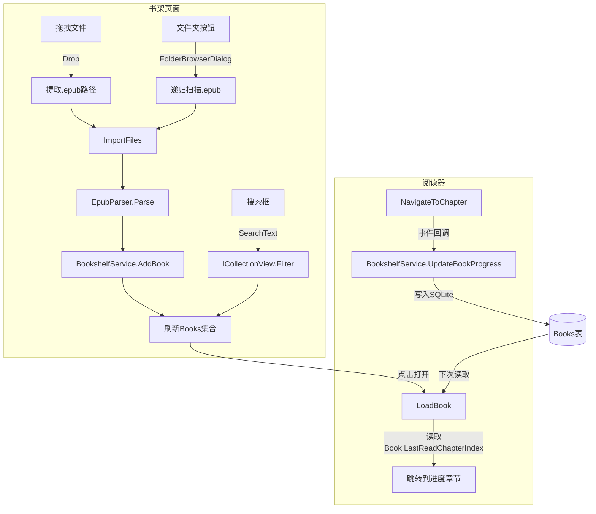

## 产品概述

这里是 Windows 平台的 EPUB 电子书阅读器，已有基本的书架管理和阅读功能。本次迭代聚焦于书架模块的功能细化与体验增强。

## 核心功能

### 1. 书架搜索/筛选

- 顶部增加搜索输入框，输入关键词实时过滤书架中的书籍
- 支持按书名、作者模糊匹配
- 搜索时书架网格自动更新，无结果时显示空状态提示

### 2. 拖拽导入 EPUB

- 支持将 .epub 文件从文件资源管理器直接拖拽到书架窗口
- 拖入时视觉反馈（高亮/提示）
- 自动解析并导入书籍，重复文件自动跳过

### 3. 批量从文件夹导入

- 新增"导入文件夹"按钮，使用文件夹选择对话框
- 递归扫描所选文件夹及子文件夹中的所有 .epub 文件
- 批量处理，逐个解析导入，失败的不影响其他文件

### 4. 阅读进度持久化与展示

- 书本关闭后自动保存当前阅读位置（章节索引、总章节数）
- 下次打开阅读器时自动恢复到上次阅读的章节
- 书架卡片上显示阅读进度条或进度百分比
- 数据库 Books 表增加进度相关字段

### 5. 书籍卡片快速删除

- 每张书籍卡片右上角增加删除按钮（X 图标），鼠标悬停时显示
- 点击删除按钮直接触发确认对话框，无需右键菜单
- 保留原有的右键菜单删除方式作为辅助入口

## 技术栈

- **框架**: .NET 10 WPF (Windows)
- **语言**: C# 13
- **MVVM**: CommunityToolkit.Mvvm 8.4.0 (ObservableProperty, RelayCommand)
- **数据持久化**: Microsoft.Data.Sqlite 10.0.0-preview
- **渲染**: Microsoft.Web.WebView2 (EPUB 内容渲染)
- **解析**: System.IO.Compression (ZIP), System.Xml.Linq (XML)

## 实施方法

### 数据模型扩展

- `Book` 模型新增 `LastReadChapterIndex` (int, 默认 -1) 和 `TotalChapters` (int, 默认 0)
- SQLite 数据库 `Books` 表通过 `ALTER TABLE` 添加对应列（使用 `InitializeDatabase` 做版本迁移或简单地用 `CREATE TABLE IF NOT EXISTS` 的升级模式）
- `BookshelfService` 新增 `UpdateBookProgress(string bookId, int chapterIndex, int totalChapters)` 方法

### 书架搜索实现

- 使用 WPF 的 `ICollectionView` 结合 `CollectionViewSource.GetDefaultView` 实现客户端过滤
- `BookshelfViewModel` 新增 `SearchText` 属性，`OnSearchTextChanged` 时触发 `ICollectionView.Refresh()`
- Filter 委托检查书名/作者是否包含搜索关键词（大小写不敏感）
- XAML 中 ItemsControl 绑定到 `ICollectionView` 而非直接 `ObservableCollection`

### 拖拽导入

- `BookshelfPage.xaml` 根 Grid 设置 `AllowDrop="True"`
- `BookshelfPage.xaml.cs` 处理 `DragOver`（检查拖拽数据是否包含 .epub 文件）和 `Drop` 事件
- Drop 事件中提取文件路径列表，过滤出 .epub 文件，通过 ViewModel 的 `ImportFiles(IEnumerable<string>)` 方法批量导入

### 批量文件夹导入

- `BookshelfViewModel` 新增 `ImportFolderCommand`
- 使用 `FolderBrowserDialog`（或开放文件对话框的文件夹选择模式）选择文件夹
- 使用 `Directory.EnumerateFiles(path, "*.epub", SearchOption.AllDirectories)` 递归扫描
- 调用已有的 `ImportBook` 内部逻辑处理每个文件

### 阅读进度保存与恢复

- `ReaderViewModel.LoadBook` 中读取 `book.LastReadChapterIndex`，若 >= 0 则加载对应章节
- `ReaderViewModel.NavigateToChapter` 中通过事件 `ProgressChanged` 通知上层（MainWindow）持久化进度
- MainWindow 在 `OnOpenBookRequested` 中订阅进度变更事件，回调 `BookshelfService.UpdateBookProgress`

### 书架进度展示

- 书籍卡片底部增加进度条（使用 WPF `ProgressBar` 或自定义 Border）
- 新增 `ProgressToPercentConverter` 将 (LastReadChapterIndex, TotalChapters) 转为 0-100 的百分比
- 进度为 0 或未开始阅读时隐藏进度条

### 书籍卡片快速删除

- `BookshelfPage.xaml` 的书籍卡片 `DataTemplate` 中，在卡片右上角新增一个圆形删除按钮
- 按钮默认不可见（Opacity=0），卡片 `IsMouseOver=True` 时淡入显示（Storyboard 动画）
- 按钮绑定 `DataContext.DeleteBookCommand`，`CommandParameter="{Binding}"`
- 按钮外观：圆形背景（半透明红），中间 X 图标（使用 Unicode ✕ 或 Path 图标）
- 点击时使用现有的确认对话框，确认后执行删除

- **代码复用**: 批量导入和拖拽导入内部都复用 `ImportBookCommand` 的解析逻辑，保持一致性
- **ICollectionView**: 用已有集合的视图过滤而非维护两个集合，避免同步问题
- **向后兼容**: 数据库加字段用 `ALTER TABLE IF NOT EXISTS` 风格，保证旧数据库能正常升级
- **事件驱动**: 阅读进度通过事件回调从 ReaderViewModel 传递到 MainWindow 再写入数据库，不破坏 MVVM 分层

## 架构设计

### 数据流图



### 核心目录结构

```
EpubRead/
├── Models/
│   └── Book.cs              # [MODIFY] 增加 LastReadChapterIndex, TotalChapters
├── Services/
│   └── BookshelfService.cs  # [MODIFY] AddBook/GetAllBooks 更新 + UpdateBookProgress
├── ViewModels/
│   ├── BookshelfViewModel.cs  # [MODIFY] 搜索、过滤、文件夹导入、批量导入
│   └── ReaderViewModel.cs     # [MODIFY] 加载进度、保存进度
├── Views/
│   ├── BookshelfPage.xaml     # [MODIFY] 搜索框、文件夹按钮、进度条、拖拽支持、卡片删除按钮
│   └── BookshelfPage.xaml.cs  # [MODIFY] Drop/DragOver 事件处理
├── Converters/
│   └── CoverPathConverter.cs  # [MODIFY] 增加 ProgressToPercentConverter
└── App.xaml                   # [NO CHANGE]
```

## 实施说明

- **性能**: 搜索过滤在客户端内存中进行，书架书籍数量通常 < 1000，即时过滤无性能问题
- **拖拽**: 仅在 Drop 时执行解析，DragOver 只做文件类型检查，避免重复打开 ZIP 包
- **数据库兼容**: 新字段通过 `ALTER TABLE` 添加，`InitializeDatabase` 中增加迁移逻辑，确保旧数据库无缝升级
- **异常处理**: 批量导入中单个文件解析失败不影响其他文件，错误通过 MessageBox 报告
- **一致性**: 所有导入入口（按钮、拖拽、文件夹）使用相同的去重逻辑（按 FilePath 检查）

# Agent Extensions

此任务不需要使用任何 Agent Extensions。所有改动均基于现有代码库模式实现，不涉及特殊工具集成。